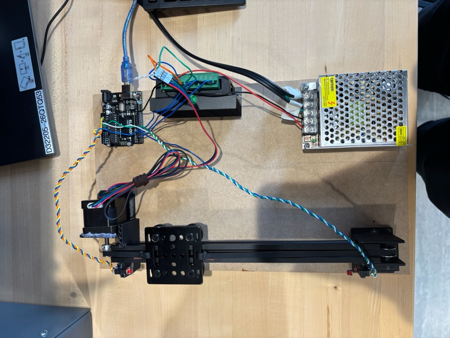
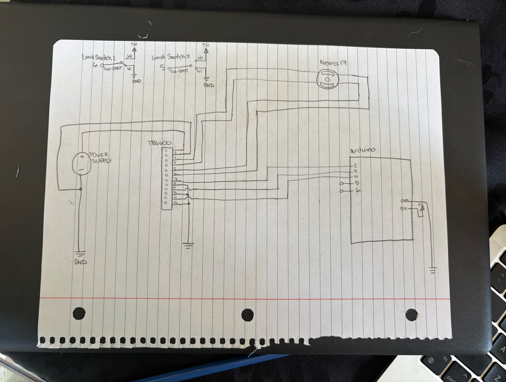
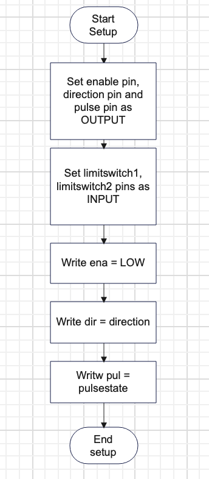
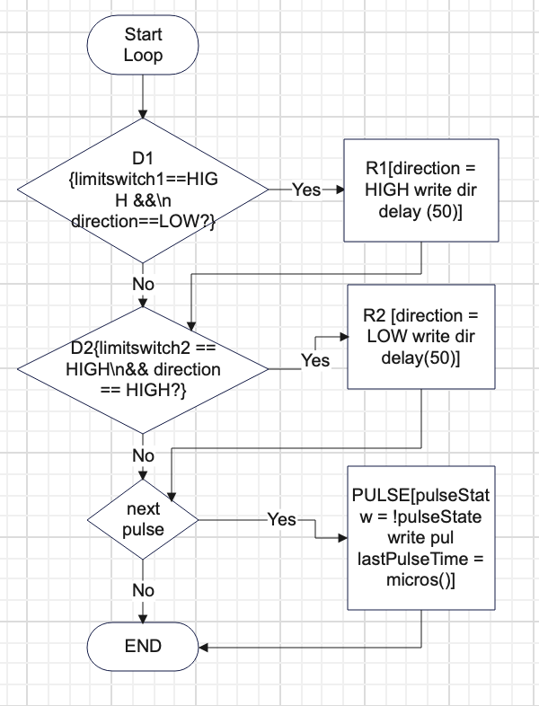
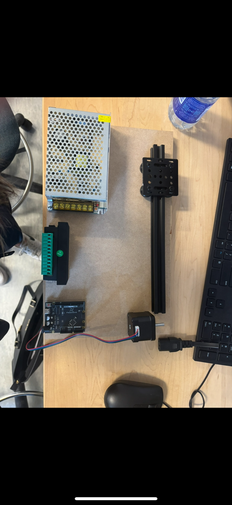
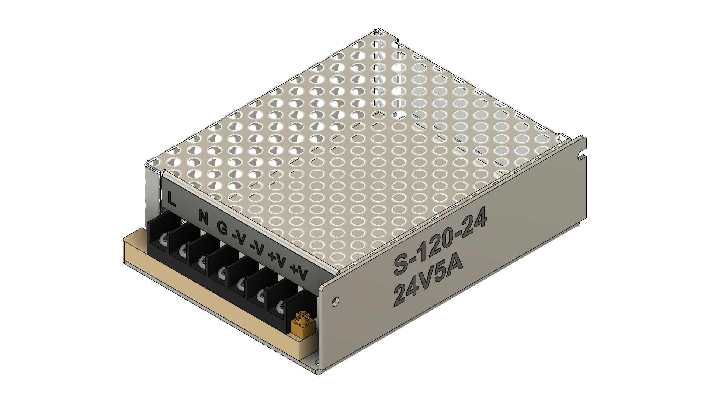

# V-Slot Bearing Gantry System

A belt-driven linear actuator built from V-slot aluminum extrusion, a NEMA 17 stepper motor, and an Arduino — the same kind of motion system used in CNC machines and 3D printers, built to demonstrate continuous, limit-switch-reversing linear motion.

## Overview

A gantry plate rides on V-slot bearings along an aluminum extrusion track, driven back and forth by a GT2 belt connected to a NEMA 17 stepper motor. A TB6600 stepper driver handles the motor pulses under Arduino control, and two mechanical limit switches — mounted on 3D-printed brackets at each end of the track — tell the Arduino when to reverse direction, producing continuous back-and-forth motion with no manual intervention.

## Objectives

- Design and assemble a belt-driven gantry using V-slot bearings and aluminum extrusion
- Drive a NEMA 17 stepper precisely via Arduino + TB6600
- Use limit switches to trigger automatic direction reversal
- Design and 3D-print the motor mount and extrusion-end brackets
- Write and validate Arduino code for motor pulsing and switch input handling

## How it works

- The Arduino pulses the TB6600 driver at a 500 µs interval using `micros()` for non-blocking timing, driving the NEMA 17 stepper smoothly in either direction
- Two normally-open, active-high limit switches (Arduino pins 5 and 6) sit at each end of the track; when the gantry trips one, the Arduino reverses the pulse direction
- A 50 ms software debounce on the switch reads prevents false direction changes from switch bounce/noise
- The TB6600's enable pin (`ENA`, active-low) is held low to keep the driver enabled throughout

| `setup()` flow | `loop()` flow |
|---|---|
|  |  |

## Running it

Wire an Arduino Uno to a TB6600 driver (ENA→pin 2, DIR→pin 3, PUL→pin 4) and a NEMA 17 stepper, with limit switches on pins 5 and 6, then upload `src/gantry_control.ino` via the Arduino IDE. No libraries required — it's plain digital I/O and `micros()` timing.

## Materials

NEMA 17 stepper motor, TB6600 stepper driver (4A), Arduino Uno (Freenove-compatible board), V-slot aluminum extrusion, gantry plate, GT2 16-tooth pulley + idler + belt, miniature roller-lever limit switches ×2, 12V 60W AC/DC power supply, 3D-printed motor holder and extrusion-end holder, wiring.

| Parts laid out before assembly | Power supply CAD render |
|---|---|
|  |  |

## Build process

Parts were modeled in Autodesk Inventor first (`cad/project-spacing.iam`) and laid out on a wooden test board to work out placement before any drilling or printing. From there: 3D-print the brackets → mount everything to the board → wire it up → validate with a basic instructor-provided test sketch → write and test the final control code.

## Results

The gantry achieved smooth, continuous motion with consistent belt tension; the only mechanical hiccup was minor belt slippage traced to the 3D-printed motor holder. Electrically, the TB6600 and limit-switch logic worked reliably once debounced.

## Contents

- `src/gantry_control.ino` — the final Arduino control code: stepper pulsing via `micros()`, limit-switch direction reversal, debounce
- `cad/project-spacing.iam` — Autodesk Inventor assembly for the gantry parts and spacing/layout
- `images/` — parts laid out before assembly, the finished gantry, the hand-drawn wiring diagram, setup/loop control-flow diagrams, and a CAD render of the power supply

## Lessons learned / what I'd change

- Wiring active-high, normally-open switches correctly required carefully matching hardware polarity to the software's `digitalRead()` checks, and debouncing (50 ms) was essential to stop false triggers
- Next time: test normally-closed switches for better noise immunity, 3D-print alignment parts earlier in the timeline, and use properly color-coded wiring to make debugging less painful
